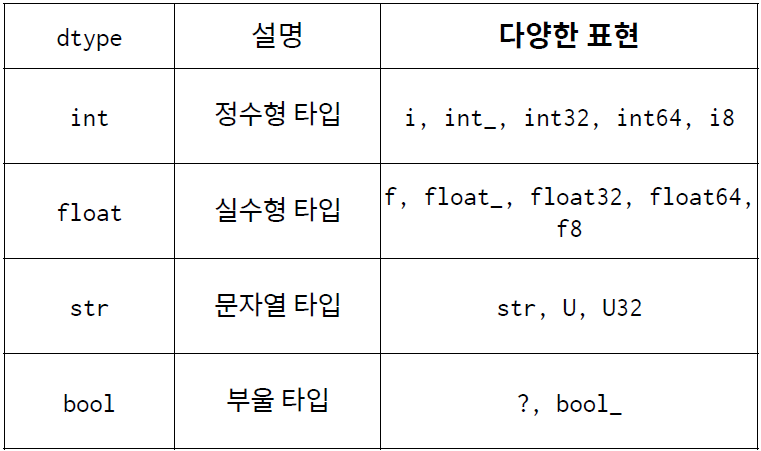

# NumPy

Python에서 대규모 다차원 배열을 다룰 수 있게 도와주는 라이브러리

## Why?

: 데이터의 대부분은 숫자 배열로 볼 수 있다.

## 배열 데이터 타입 dtype



- 실습 코드

    ```python
    arr = np.array([1,2,3,4], dtype=float)
    arr.dtype # data type 확인
    arr.astype(int) # 형 변환
    ```

## 다양한 배열 만들기

- 실습 코드

    ```python
    np.zeros(10, dtype=int)
    np.ones((3,5), dtype=float) # 행과 열을 만들어줌, series 형태
    np.arange(0,20,2)
    np.linspace(0,1,5) # 
    ```

    ```
    array([ 0,  2,  4,  6,  8, 10, 12, 14, 16, 18])
    array([0.  , 0.25, 0.5 , 0.75, 1.  ])
    ```

## 배열 만들기

1. 배열의 기초
    - 실습

        ```python
        x2 = np.random.randint(10, size=(3,4))
        print(f"ndim: {x2.ndim}, shape: {x2.shape}, size: {x2.size}, dtype: {x2.dtype}")
        ```

        ```
        ndim: 2, shape: (3, 4), size: 12, dtype: int32
        ```

2. Indexing / Slicing
    - 실습

        ```python
        # 파이썬 코드
        x = np.arange(7)
        x[3] = 10
        x
        print(x[1:4])
        print(x[1:])
        print(x[:4])
        print(x[::2]) # interval
        ```

        ```
        array([ 0,  1,  2, 10,  4,  5,  6])
        [ 1  2 10]
        [ 1  2 10  4  5  6]
        [ 0  1  2 10]
        [0 2 4 6]
        ```

3. reshape

    : array의 shape를 변경

    - 실습

        ```python
        # 파이썬 코드
        x = np.arange(8)
        print(x.shape)
        x2 = x.reshape((2,-1))
        print(x2.shape)
        ```

        ```
        (8,)
        (2, 4)
        ```

4. concatenate

    : axis 축을 기준으로 array를 이어 붙임

    - 실습

        ```python
        # 파이썬 코드
        x = np.array([0,1,2])
        y = np.array([3,4,5])
        print(np.concatenate([x,y]))

        matrix = np.arange(4).reshape(2,2)
        print (matrix)
        matrix2 = np.concatenate([matrix, matrix], axis=0)
        print(matrix2)
        matrix3 = np.concatenate([matrix, matrix], axis=1)
        print(matrix3)
        ```

        ```
        [0 1 2 3 4 5]
        [[0 1]
         [2 3]]
        [[0 1]
         [2 3]
         [0 1]
         [2 3]]
        [[0 1 0 1]
         [2 3 2 3]]
        ```

5. split

    : axis 축을 기준으로 분할

    - 실습

        ```python
        # 파이썬 코드
        matrix = np.arange(16).reshape(4,4)
        upper, lower = np.split(matrix, [3], axis=0)
        print(matrix)
        print()
        print(upper)
        print()
        print(lower)
        matrix = np.arange(16).reshape(4,4)
        left, right = np.split(matrix, [3], axis=1)
        print(matrix)
        print()
        print(left)
        print()
        print(right)
        ```

        ```
        [[ 0  1  2  3]
         [ 4  5  6  7]
         [ 8  9 10 11]
         [12 13 14 15]]

        [[ 0  1  2  3]
         [ 4  5  6  7]
         [ 8  9 10 11]]

        [[12 13 14 15]]

        [[ 0  1  2  3]
         [ 4  5  6  7]
         [ 8  9 10 11]
         [12 13 14 15]]

        [[ 0  1  2]
         [ 4  5  6]
         [ 8  9 10]
         [12 13 14]]

        [[ 3]
         [ 7]
         [11]
         [15]]
        ```

## NumPy 연산

루프는 느리다.
But, array는 사칙연산을 지원한다.

1. 기본연산
    - 실습

        ```python
        # 파이썬 코드
        x = np.arange(4)
        print(x)
        print(x+5)
        print(x-5)
        print(x*5)
        print(x/5)
        ```

        ```
        [0 1 2 3]
        [5 6 7 8]
        [-5 -4 -3 -2]
        [ 0  5 10 15]
        [0.  0.2 0.4 0.6]
        ```

2. 행렬간 연산
    - 실습

        ```python
        # 파이썬 코드
        x = np.arange(4).reshape((2, 2))
        y = np.random.randint(10, size=(2, 2))
        print(x)
        print(y)
        print(x + y)
        print(x - y)
        ```

        ```
        [[0 1]
         [2 3]]
        [[2 4]
         [9 9]]
        [[ 2  5]
         [11 12]]
        [[-2 -3]
         [-7 -6]]
        ```

3. 브로드 캐스팅

### 집계함수

- 실습

    ```python
    # 파이썬 코드
    x = np.arange(8).reshape((2,4))
    print(x)
    print(np.sum(x))
    print(np.min(x))
    print(np.max(x))
    print(np.mean(x))
    print(np.sum(x, axis=0)) # 0은 행 기준/방향
    print(np.sum(x, axis=1))
    ```

    ```
    [[0 1 2 3]
     [4 5 6 7]]
    28
    0
    7
    3.5
    [ 4  6  8 10]
    [ 6 22]
    ```

### 마스킹 연산

- 실습

    ```python
    # 파이썬 코드
    x = np.arange(5)
    print(x<3)
    print(x>5)
    print(x[x<3])
    ```

    ```
    [ True  True  True False False]
    [False False False False False]
    [0 1 2]
    ```

- 실습

    ```python
    # 파이썬 코드
    ```

    ```
    ndim: 2, shape: (3, 4), size: 12, dtype: int32
    ```