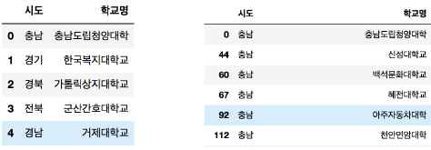

# Pandas - Advanced

구조화된 데이터를 효과적으로 처리하고 저장
Array 계산에 특화된 NumPy를 기반으로 설계

## 조건으로 검색하기

- masking 연산이 가능
    - 실습

        ```python
        # 파이썬 코드
        df = pd.DataFrame(np.random.rand(5, 2), columns=['A', 'B'])
        print(df)
        df['A'] < 0.5
        ```

        ```
        					A         B
        0  0.344589  0.556269
        1  0.612450  0.223649
        2  0.144317  0.000979
        3  0.864558  0.095993
        4  0.248986  0.382667
        0     True
        1    False
        2     True
        3    False
        4     True
        Name: A, dtype: bool
        ```

- 조건에 맞는 row를 추출
    - 실습

        ```python
        # 파이썬 코드
        print(df[(df['A'] < 0.5) & (df['B'] > 0.3)])
        print()
        print(df.query('A<0.5 and B>0.3'))
        ```

        ```
        A         B
        0  0.344589  0.556269
        4  0.248986  0.382667

                  A         B
        0  0.344589  0.556269
        4  0.248986  0.382667
        ```

- 문자열 조건 검색
    - 실습

        ```python
        # 파이썬 코드
        df_a = pd.DataFrame(columns=['Animal', 'Name'])
        df_a.loc[0] = ['Dog', 'Happy']
        df_a.loc[1] = ['Cat', 'Sam']
        df_a.loc[2] = ['Cat', 'Toby']
        df_a.loc[3] = ['Pig', 'Mini']
        df_a.loc[4] = ['Cat', 'Rocky']
        print(df_a)
        df_a["Animal"].str.contains("Cat")
        df_a.Animal.str.match("Cat")
        ```

        ```
        Animal   Name
        0    Dog  Happy
        1    Cat    Sam
        2    Cat   Toby
        3    Pig   Mini
        4    Cat  Rocky
        0    False
        1     True
        2     True
        3    False
        4     True
        Name: Animal, dtype: bool
        ```

## 함수로 데이터 처리하기

- `apply`를 통해서 함수로 데이터를 다루자
    - 실습1

        ```python
        # 파이썬 코드
        df = pd.DataFrame(np.arange(5), columns=["Num"])

        def square(x):
            return x**2
        df['Num'].apply(square)

        df['Square'] = df.Num.apply(lambda x: x**2)
        print(df['Num'].apply(square))
        print(df)
        ```

        ```
        0     0
        1     1
        2     4
        3     9
        4    16
        Name: Num, dtype: int64
           Num  Square
        0    0       0
        1    1       1
        2    2       4
        3    3       9
        4    4      16
        ```

    - 실습2

        ```python
        # 파이썬 코드
        df_2 = pd.DataFrame(columns=["phone"])
        df_2.loc[0] = "010-1234-1235"
        df_2.loc[1] = "공일공-일이삼자-1235"
        df_2.loc[2] = "010.1234.5235"
        df_2.loc[3] = "공1공-일234-1235"
        df_2['preprocess_phone'] = ''

        def get_preprocess_phone(phone):
            mapping_dict = {
                '공': "0",
                '일': "1",
                '이': "2",
                '삼': "3",
                '사': "4",
                '오': "5",
                "-": "",
                ".": ""
            }
            for key, value in mapping_dict.items():
                phone = phone.replace(key, value)
            return phone
        df_2['preprocess_phone'] = df_2['phone'].apply(get_preprocess_phone)
        print(df_2)
        ```

        ```
        phone preprocess_phone
        0  010-1234-1235      01012341235
        1  공일공-일이삼자-1235      010123자1235
        2  010.1234.5235      01012345235
        3  공1공-일234-1235      01012341235
        ```

- `replace`
    - 실습

        ```python
        # 파이썬 코드
        df_s = pd.DataFrame(columns = ['Sex'])
        df_s.loc[0] = "Male"
        df_s.loc[1] = "Male"
        df_s.loc[2] = "Female"
        df_s.loc[3] = "Female"
        df_s.loc[4] = "Male"

        print(df_s)
        df_s.Sex.replace({'Male': 0, 'Female': 1})
        df_s.Sex.replace({'Male': 0, 'Female': 1}, inplace=True)
        ```

        ```
        0    0
        1    0
        2    1
        3    1
        4    0
        Name: Sex, dtype: int64
        ```

## 그룹으로 묶기

- 조건부로 집계
    - 실습

        ```python
        # 파이썬 코드
        # 조건부 집계
        df_g = pd.DataFrame({'key':['A', 'B', 'C', 'A', 'B', 'C'],
                           'data': range(6)})
        df_g.groupby('key')

        print(df_g.groupby('key').sum())
        print(df_g.groupby(['key', 'data']).sum())
        ```

        ```
        data
        key      
        A       3
        B       5
        C       7
        Empty DataFrame
        Columns: []
        Index: [(A, 0), (A, 3), (B, 1), (B, 4), (C, 2), (C, 5)]
        ```

- `aggregate` - groupby를 통해 집계를 한번에 계산
    - 실습

        ```python
        # 파이썬 코드
        df = pd.DataFrame({'key': ['A', 'B', 'C', 'A', 'B', 'C'],'data1': range(6), 'data2': [4,4,6,0,6,1]})
        df.groupby('key').aggregate(['min', np.median, max])
        ```

        ```
        data1	data2
        min	median	max	min	median	max
        key						
        A	0	1.5	3	0	2.0	4
        B	1	2.5	4	4	5.0	6
        C	2	3.5	5	1	3.5	6
        ```

- `filter` - 그룹 속성을 기준으로 데이터 필터링
    - 실습

        ```python
        # 파이썬 코드
        def filter_by_mean(x):
            return x['data2'].mean() > 3

        df.groupby('key').mean()
        df.groupby('key').filter(filter_by_mean)
        ```

        ```
        key	data1	data2
        1	B	1	4
        2	C	2	6
        4	B	4	6
        5	C	5	1
        ```

- `apply`
    - 실습

        ```python
        # 파이썬 코드
        df.groupby('key').apply(lambda x: x.max()-x.min())
        ```

        ```
        data1	data2
        key		
        A	3	4
        B	3	2
        C	3	5
        ```

- `get_group`
    - 실습

        ```python
        # 파이썬 코드
        df = pd.read_csv("./univ.csv")
        df.head()
        df.groupby("시도").get_group("충남")
        len(df.groupby("시도").get_group("충남"))
        ```

        

## MultiIndex

- 인덱스를 계층적으로 만들자
    - 실습

        ```python
        # 파이썬 코드
        df = pd.DataFrame(
            np.random.randn(4, 2),
            index = [['A','A','B','B'], [1, 2, 1, 2]],
            columns = ['data1', 'data2']
        )
        ```

        

- 열 인덱스의 계층화
    - 실습

        ```python
        # 파이썬 코드
        df = pd.DataFrame(
            np.random.randn(4,4),
            columns = [['A','A','B','B'], ['1','2','1','2']]
        )
        ```

        

- 다중 인덱스 컬럼의 경우 인덱싱은 계층적
    - 실습

        ```python
        # 파이썬 코드
        df["A"]
        df['A']['1']
        ```

        ```
        1	2
        0	1.042024	-0.441867
        1	-0.148847	0.346650
        2	0.649289	-0.982276
        3	-1.776059	-0.974513

        0    1.042024
        1   -0.148847
        2    0.649289
        3   -1.776059
        Name: 1, dtype: float64
        ```

## pivot_table

데이터에서 필요한 자료만 뽑아와서 새롭게 요약, 분석 할 수 있는 기능.
Index: 행 인덱스로 들어갈 key
Column: 열 인덱스로 라벨링될 값
Value: 분석할 데이터

- 실습

    ```python
    # 파이썬 코드

    ```

    ```

    ```