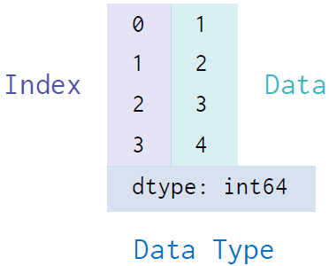

# Pandas - Basic

구조화된 데이터를 효과적으로 처리하고 저장
Array 계산에 특화된 NumPy를 기반으로 설계

- To-do
    - [ ]  Fourier Transform
    - [ ]  NLP

## Series

- numpy array가 보강된 형태

    

- Data와 Index를 가지고 있음.
    - 실습

        ```python
        # 파이썬 코드
        data = pd.Series([1, 2, 3, 4], index=['a', 'b', 'c', '라'])
        print(data)
        print(data['b'])
        print(data.b)
        print(data.라)
        ```

        ```
        a    1
        b    2
        c    3
        d    4
        dtype: int64
        2
        2
        4
        ```

- `name` 인자로 이름을 지정할 수 있음
    - 실습

        ```python
        # 파이썬 코드
        data = pd.Series([1, 2, 3, 4], index=['a', 'b', 'c', 'd'], name= "Title")
        data
        ```

        ```
        a    1
        b    2
        c    3
        d    4
        Name: Title, dtype: int64
        ```

- 딕셔너리로 반환
    - 실습

        ```python
        # 파이썬 코드
        population_dict = {
        'korea': 5180,
        'japan': 12718,
        'china': 141500,
        'usa': 32676
        }
        population = pd.Series(population_dict)
        print(population)
        ```

        ```
        korea      5180
        japan     12718
        china    141500
        usa       32676
        dtype: int64
        ```

## DataFrame

여러 개의 Series가 모여서 행과 열을 이룬 데이터

- 딕셔너리로 변환할 수 있음
    - 실습

        ```python
        # 파이썬 코드
        gdp_dict = {
        'korea': 169320000,
        'japan': 516700000,
        'china': 1409250000,
        'usa': 2041280000,
        }
        gdp = pd.Series(gdp_dict)
        country = pd.DataFrame({
        'population': population,
        'gdp': gdp
        })

        print(country.index)
        print(country.columns)
        print(country['gdp'])
        print(type(country['gdp']))
        ```

        ```
        Index(['korea', 'japan', 'china', 'usa'], dtype='object')
        Index(['population', 'gdp'], dtype='object')
        korea     169320000
        japan     516700000
        china    1409250000
        usa      2041280000
        Name: gdp, dtype: int64
        <class 'pandas.core.series.Series'>
        ```

- Serires도 numpy array처럼 연산자를 활용
    - 실습

        ```python
        # 파이썬 코드
        gdp_per_capita = country['gdp'] / country['population']
        country['gdp per capita'] = gdp_per_capita
        print(country['gdp per capita'])
        ```

        ```
        korea    32687.258687
        japan    40627.457147
        china     9959.363958
        usa      62470.314604
        Name: gdp per capita, dtype: float64
        ```

- 저장과 불러오기, 데이터 프레임을 저장
    - 실습

        ```python
        # 파이썬 코드
        country.to_csv("./country.csv")
        country.to_excel("country.xlsx")
        country = pd.read_csv("./country.csv")
        country = pd.read_excel("country.xlsx")
        print(country)
        ```

        ```
        Unnamed: 0 Unnamed: 0.1  population         gdp  gdp per capita
        0           0        korea        5180   169320000    32687.258687
        1           1        japan       12718   516700000    40627.457147
        2           2        china      141500  1409250000     9959.363958
        3           3          usa       32676  2041280000    62470.314604
        ```

- Indexing/Slicing
    1. `loc` - 명시적인 인덱스를 참조함
        - 실습

            ```python
            # 파이썬 코드
            country.loc['china']
            country.loc['korea':'japan', :'population']
            ```

            ```
            population        1.415000e+05
            gdp               1.409250e+09
            gdp per capita    9.959364e+03
            Name: china, dtype: float64
            			population
            korea	5180
            japan	12718
            ```

    2. `iloc` - 파이썬 스타일 정수 인덱스 (이게 더 많이 쓰임)
        - 실습

            ```python
            # 파이썬 코드
            country.iloc[0]
            country.iloc[1:3, :2]
            ```

            ```
            population        5.180000e+03
            gdp               1.693200e+08
            gdp per capita    3.268726e+04
            Name: korea, dtype: float64
            			population	gdp
            japan	12718	516700000
            china	141500	1409250000
            ```

    3. 리스트로 추가 or 딕셔너리로 추가
        - 실습

            ```python
            # 파이썬 코드
            df = pd.DataFrame(columns=['이름', '나이', '주소'])
            df.loc[0] = ['영희', '24', '서울']
            df.loc[1] = {'이름': '철수', '나이': '29', '주소':'인천'}

            print(df)
            print()

            df.loc[1, '이름'] = '개명'
            print(df)
            ```

            ```
            이름  나이  주소
            0  영희  24  서울
            1  철수  29  인천

               이름  나이  주소
            0  영희  24  서울
            1  개명  29  인천
            ```

- 새 데이터 추가/수정
    - 실습

        ```python
        # 파이썬 코드
        df = pd.DataFrame(columns=['이름', '나이', '주소'])
        df.loc[0] = ['영희', '24', '서울']
        df.loc[1] = {'이름': '철수', '나이': '29', '주소':'인천'}

        print(df)
        print()

        df.loc[1, '이름'] = '개명'
        print(df)
        ```

        ```
        이름  나이  주소
        0  영희  24  서울
        1  철수  29  인천

           이름  나이  주소
        0  영희  24  서울
        1  개명  29  인천
        ```

- 새 column 추가
    - 실습

        ```python
        # 파이썬 코드
        import numpy as np
        df['전화번호'] = np.nan
        df.loc[0, '전화번호'] = '01012341234'

        print(df)
        print(f"length of df: {len(df)}")
        ```

        ```
        이름  나이  주소         전화번호
        0  영희  24  서울  01012341234
        1  개명  29  인천          NaN
        length of df: 2
        ```

- 컬럼 선택하기
    - 실습

        ```python
        # 파이썬 코드
        print(df['이름'])
        print(df[['이름', '주소']])
        df.info()
        ```

        ```
        0    영희
        1    개명
        Name: 이름, dtype: object
           이름  주소
        0  영희  서울
        1  개명  인천

        <class 'pandas.core.frame.DataFrame'>
        Int64Index: 2 entries, 0 to 1
        Data columns (total 4 columns):
         #   Column  Non-Null Count  Dtype 
        ---  ------  --------------  ----- 
         0   이름      2 non-null      object
         1   나이      2 non-null      object
         2   주소      2 non-null      object
         3   전화번호    1 non-null      object
        dtypes: object(4)
        memory usage: 160.0+ bytes
        ```

## Pandas 연산과 함수

- 누락된 데이터 체크

    : 현실 데이터는 일부 누락되어 있는 형태가 많음

    - 실습

        ```python
        # 파이썬 코드
        print(df.isnull())
        print(df.notnull())

        df_na = df.dropna()
        print(df_na)
        print()
        df['전화번호'] = df['전화번호'].fillna('전화번호 없음')
        print(df)
        ```

        ```
        이름     나이     주소   전화번호
        0  False  False  False  False
        1  False  False  False   True
             이름    나이    주소   전화번호
        0  True  True  True   True
        1  True  True  True  False

        이름  나이  주소         전화번호
        0  영희  24  서울  01012341234

           이름  나이  주소         전화번호
        0  영희  24  서울  01012341234
        1  개명  29  인천      전화번호 없음
        ```

- Series 연산
    - 실습

        ```python
        # 파이썬 코드
        A = pd.Series([2, 4, 6], index=[0, 1, 2])
        B = pd.Series([1, 3, 5], index=[1, 2, 3])
        print(A + B)
        A.add(B, fill_value=0)
        print(A)
        ```

        ```
        0    NaN
        1    5.0
        2    9.0
        3    NaN
        dtype: float64
        0    2
        1    4
        2    6
        dtype: int64
        ```

- DataFrame 연산
    - 실습

        ```python
        # 파이썬 코드
        A = pd.DataFrame(np.random.randint(0, 10, (2, 2)), columns=list("AB"))
        B = pd.DataFrame(np.random.randint(0, 10, (3, 3)), columns=list("BAC"))
        print(A)
        print()
        print(B)
        print()
        print(A + B)
        print()
        A.add(B, fill_value=0)
        print(A.add(B, fill_value=0))
        ```

        ```
        	 A  B
        0  7  1
        1  5  7

           B  A  C
        0  2  5  2
        1  9  7  5
        2  1  1  2

              A     B   C
        0  12.0   3.0 NaN
        1  12.0  16.0 NaN
        2   NaN   NaN NaN

        			A    B    C
        0   0.0  7.0  0.0
        1  12.0  9.0  5.0
        2   0.0  3.0  6.0
        ```

- 집계함수
    - 실습

        ```python
        # 파이썬 코드
        data = {
        'A': [ i+5 for i in range(3) ],
        'B': [ i**2 for i in range(3) ]
        }
        df = pd.DataFrame(data)
        print(df)
        print()
        print(df['A'].sum())
        print()
        print(df.sum())
        print()
        print(df.mean())
        ```

        ```
        	 A  B
        0  5  0
        1  6  1
        2  7  4

        18

        A    18
        B     5
        dtype: int64

        A    6.000000
        B    1.666667
        dtype: float64
        ```

## DataFrame 정렬하기

- dataframe
    - 실습

        ```python
        # 파이썬 코드
        df = pd.DataFrame({
            'col1' : [2, 1, 9, 8, 7, 4],
            'col2' : ['A', 'A', 'B', np.nan, 'D', 'C'],
            'col3': [0, 1, 9, 4, 2, 3]
        })
        ```

        ```
        col1 col2  col3
        0     2    A     0
        1     1    A     1
        2     9    B     9
        3     8  NaN     4
        4     7    D     2
        5     4    C     3
        ```

- `df.sort_values('col1')`
    - 결과

        ```
        col1	col2	col3
        1	1	A	1
        0	2	A	0
        5	4	C	3
        4	7	D	2
        3	8	NaN	4
        2	9	B	9
        ```

- `df.sort_values('col1', ascending=False)`
    - 결과

        ```
        col1	col2	col3
        2	9	B	9
        3	8	NaN	4
        4	7	D	2
        5	4	C	3
        0	2	A	0
        1	1	A	1
        ```

- `df.sort_values(['col2', 'col1'])`
    - 결과

        ```
        col1	col2	col3
        1	1	A	1
        0	2	A	0
        2	9	B	9
        5	4	C	3
        4	7	D	2
        3	8	NaN	4
        ```

- `df.sort_values(['col2', 'col1'], ascending=False)`
    - 결과

        ```
        col1	col2	col3
        4	7	D	2
        5	4	C	3
        2	9	B	9
        0	2	A	0
        1	1	A	1
        3	8	NaN	4
        ```