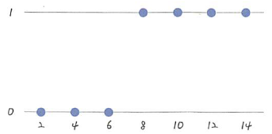

# 05 참 거짓 판단 장치: 로지스틱 회귀

- **Keywords**
    - **로지스틱 회귀**
    - **시그모이드 함수**
    - **오차 공식**
    - **로그 함수**
    - **퍼셉트론**

**로지스틱 회귀(Logistic regression)**: 참과 거짓 중에 하나를 내놓는 과정

만약, 3개 이상의 입력 값을 다룬다면, softmax 함수를 사용해야 함.

## 로지스틱 회귀의 정의

- 선형 회귀에서 보았던 점수 예측이 아니라, 합격/불합격만 발표되는 시험이 있다고 가정.



합/불만 있을 때 좌표 표현

- 이 점의 특성을 잘 나타내는 일차 방정식을 만들기 어려움.
- 로지스틱 회귀 역시 적절한 선을 그려가는 과정이다.


- S자 형태의 선을 그어주는 작업

## 시그모이드 함수

- 공식: 결국 ax+b를 구해야 함.

$$y = \frac{1}{1 + e^{ax+b}}$$

- a, b 값에 따른 함수의 변화 정도는 아래와 같다.


- a, b 값에 따라 변화하는 오차를 그래프는 아래와 같다.


## 오차 공식

- a, b 값은 경사 하강법을 통해 계산한다.
- 시그모이드 함수의 특징은 y값이 0과 1사이라는 것.
- 실제 값이 1일 때 ⇒ 예측 값이 0에 가까워지면 ⇒ 오차가 커진다.

## 로그 함수


- 파란색: 실제 값이 1일 때 사용하는 그래프, 예측 값이 1일 때 오차가 0이고, 예측 값이 0에 가까울수록 오차가 커진다.
- 빨간색: 실제 값이 0일 때 사용하는 그래프.

$$-\left \{ y_{data}\log h+ (1-y_{data}\log (1-h)) \right \}$$

- 실제 값을 $y_{data}$라고 할 때, 이 값이 1이면  뒷부분이 없어진다. 반대로 0이면, 앞 부분이 없어진다.
- 따라서, 실제 값에 따라 빨간색, 파란색 그래프를 각각 사용 가능하다.

## 로지스틱 회귀에서 퍼셉트론으로

- 입력 값을 통해 출력 값을 구하는 함수 `y` 는 아래와 같다.

$$y = a_{1}x_{1} + a_{2}x_{2} + b$$

- 입력 값: $x_1$과 $x_2$ / 출력 값: $y$
- 즉, 출력 값을 구하기 위해 $a_1$, $a_2$ 그리고 $b$ 값이 필요함.


- 이 그림은 1957년, 코넬 항공 연구소의 프랑크 로젠블란트 사람이 고안해 발표 ⇒ **Perceptron**이라는 이름을 붙였다.
- 퍼셉트론은 인공신경망, 오차 역전파 등의 발전을 거쳐 지금의 딥러닝으로 연결됨.

---

## 코딩으로 확인하는 로지스틱 회귀

- 코드

    ```python
    '''
    모두의 딥러닝 5장 로지스틱 회귀

    작성자: 이선웅
    작성일: 2021.05.10
    '''
    import numpy as np
    import pandas as pd
    import matplotlib.pyplot as plt

    # 공부 시간 X와 성적 Y의 리스트를 만들기
    data = [[2,0], [4,0], [6,0], [8,1], [10,1], [12,1], [14,1]]

    X_data = [i[0] for i in data]
    y_data = [i[1] for i in data]

    plt.scatter(X_data,y_data)
    plt.xlim(0, 15), plt.ylim(-.1, 1.1)
    plt.show()

    a = 0
    b = 0

    lr = 0.05

    def sigmoid(x):
        return 1 / (1+np.e**(-x))

    epochs = 2001

    # epoch 만큼 반복
    for i in range(epochs):
        #plt.cla()
        for x_data, y_data in data:
            a_diff = x_data*(sigmoid(a*x_data + b) - y_data)
            b_diff = sigmoid(a*x_data + b) - y_data
            # 학습률을 곱해 업데이트
            a = a - lr*a_diff
            b = b - lr*b_diff
            if i%1000 == 0:
                print(f"epoch = {i}, 기울기 = {a}, 절편 = {b}")

        plt.scatter(x_data, y_data)
        plt.xlim(0,15), plt.ylim(-.1, 1.1)
        x_range = (np.arange(0, 15, 0.1))
        plt.plot(np.arange(0, 15, 0.1), np.array([sigmoid(a*x + b) for x in x_range]))
    plt.show()
    ```

- 결과

    

    ```
    epoch = 0, 기울기 = -0.05, 절편 = -0.025
    epoch = 0, 기울기 = -0.13879722189107602, 절편 = -0.047199305472769
    epoch = 0, 기울기 = -0.2267516349901771, 절편 = -0.06185837432261918
    epoch = 0, 기울기 = 0.12010284223274431, 절편 = -0.018501564669754007
    epoch = 0, 기울기 = 0.23740192458962306, 절편 = -0.006771656434066131
    epoch = 0, 기울기 = 0.27045811205658526, 절편 = -0.004016974145152613
    epoch = 0, 기울기 = 0.2860409628939473, 절편 = -0.0029039133710553225
    epoch = 1000, 기울기 = 1.497824502953391, 절편 = -9.940123304992555
    epoch = 1000, 기울기 = 1.4940419536789271, 절편 = -9.94106894231117
    epoch = 1000, 기울기 = 1.4119848217717417, 절편 = -9.954745130962369
    epoch = 1000, 기울기 = 1.4949143121842228, 절편 = -9.944378944660809
    epoch = 1000, 기울기 = 1.498244938547387, 절편 = -9.944045882024492
    epoch = 1000, 기울기 = 1.4984392510394648, 절편 = -9.94402968931682
    epoch = 1000, 기울기 = 1.4984505498747405, 절편 = -9.944028882257157
    epoch = 2000, 기울기 = 1.9064689962225458, 절편 = -12.948894836795326
    epoch = 2000, 기울기 = 1.9054981310086199, 절편 = -12.949137553098806
    epoch = 2000, 기울기 = 1.8514893310246738, 절편 = -12.958139019762797
    epoch = 2000, 기울기 = 1.9056614126778697, 절편 = -12.951367509556148
    epoch = 2000, 기울기 = 1.9067744947792462, 절편 = -12.95125620134601
    epoch = 2000, 기울기 = 1.9068037073321078, 절편 = -12.951253766966605
    epoch = 2000, 기울기 = 1.9068044592233457, 절편 = -12.951253713260089
    ```

    