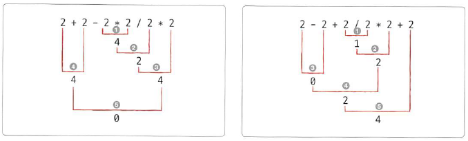

# 02-2 숫자

- **Keywords**
    - **숫자 자료형**: 소수점이 없는 정수형 & 소수점 잇는 실수형(부동 소수점)
    - **숫자 연산자**: 사칙 연산자와 정수 나누기 연산자, 나머지 연산자, 제곱 연산자 있음.
    - **연산자 우선순위**: 1) 곱하기 나누기, 2) 더하기 빼기, 3) 잘 모를때는 괄호

소수점이 없는 숫자: **정수형**, 소수점이 있는 숫자를 **실수형**

**부동 소수점**: 소수점이 움직이는 숫자

## 숫자의 종류

- int, integer: **정수**
- float, floating point: **부동 소수점(실수)**

## 숫자 연산자

문자열의 연산자와 같이 숫자에도 연산자를 적용, 서로 사용법은 다르다.

### 사칙 연산자: +,-,*,/

- 파이썬에서도 기본 사칙 연산자를 그대로 사용 가능.

### 정수 나누기 연산자: //

- 몫
- 숫자를 나누고 소수점 이하의 자릿수를 떼어 버린 후, 정수 부분만 남긴다.

### 나머지 연산자: %

- 나머지

### 제곱 연산자: **

## 연산자의 우선순위

연산자에는 **우선순위**가 존재.

### TypeError 예외

- 서로 다른 자료를 연산하면 TypeError라는 예외가 발생
- 형변환 함수 `int(변수명)` 또는 `map()` 을 사용

---

## 좀 더 알아보기

- 문자열 연산자의 우선순위

    

- 따라서, 문자열도 곱셈 연산자와 같은 *가 우선한다는 것을 확인.