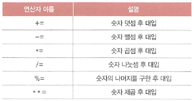

# 02-3 변수와 입력

- **Keywords**
    - **변수 선언**: 변수를 생성, 변수 할당: 변수에 값을 넣음
    - **변수 참조**: 변수에서 값을 꺼냄
    - **input()**: 명령 프롬프트에서 사용자로부터 데이터를 입력
    - **int()**: 문자열을 int 자료형으로, **float()**: 문자열을 float 자료형으로
    - **str()**:  숫자를 문자로

**변수**는 값을 저장할 때 사용하는 **식별자**.

## 변수 만들기/사용하기

```python
pi = 3.141592
```

1. 변수를 선언하는 방법
⇒ pi를 사용하겠다고 선언
2. 변수에 값을 할당하는 방법
⇒ pi에 3.141592라는 값을 할당
3. 변수를 참조하는 방법
⇒ 변수에서 값을 꺼냄

## 복합 대입 연산자

- 변수를 활용하면 기존의 연산자와 조합해서 사용할 수 있는 연산자

    ```python
    a += 10
    ```

- 숫자에 적용할 수 있는 복합 대입 연산자



## 사용자 입력: input()

명령 프롬프트에서 사용자로부터 데이터를 입력받을 때 input()함수 활용

### input() 함수로 사용자 입력 받기

- 사용자로부터 데이터를 입력.

```python
string = input("인사말> ") # 프롬프트 문자열
```

- **블록(block)**: 프로그램이 실행 도중에 잠시 멈추는 것

### input() 함수의 입력 자료형

- input()의 return 값은 string 자료형이다.
- 입력받은 모든 값은 문자열로 저장된다.

## 문자열을 숫자로 바꾸기

영어로 캐스트(Cast)라고 함.

- **int()**: 문자열을 int 자료형으로 변환
- **float()**: 문자열을 float 자료형으로 변환


### ValueError 예외

- 자료형을 변환할 때 **변환할 수 없는 것**을 변환하려고 하면 ValueError가 발생
1. 숫자가 아닌 것을 숫자로 변환
2. 소수점이 있는 숫자 형식의 문자열을 int() 함수로 변환

## 숫자를 문자열로 바꾸기

- str()  하수의 매개변수에 대입하면 문자열로 변환