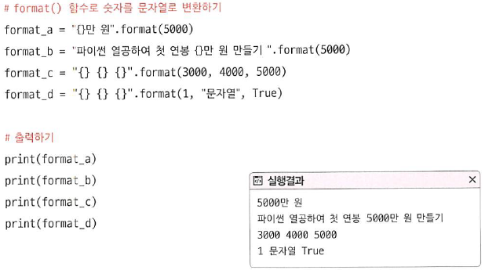

# 02-4 숫자와 문자열의 다양한 기능

- **Keywords**
    - **format()**: 숫자와 문자열을 다양한 형태로 출력
    - **upper(), lower()**: 문자열의 알파벳을 대문자 or 소문자로 변경
    - **strip()**: 문자열 양 옆의 공백 제거
    - **find()**: 문자열 내부의 특정 문자 탐색
    - **in 연산자**: 문자열 내부에 특정 문자열이 있는지 확인
    - **split()**: 문자열을 특정 문자로 분할

문자열 뒤에 마침표(.)를 입력해 자동 완성 기능을 탐색.

## 문자열의 format()함수

- `format()` 함수는 문자열이 가지고 있는 함수.



### IndexError 예외

- {} 기호의 개수가 format()함수의 매개변수 개수보다 많으면 IndexError 예외가 발생

## format() 함수의 다양한 기능

- format() 함수는 숫자와 관련해서도 다양한 기능 보유

### 정수 출력의 다양한 형태

- 정수를 특정 칸에 출력 + 기호를 붙여서 출력하기

    

### 부동 소수점 출력의 다양한 형태

- 소수점 아래 자릿수 지정하기

    

### 의미 없는 소수점 제거하기

- 0과 0.0을 출력할 때, 내부적으로 자료형이 다르므로 의미없는 0을 제거해보자.

    

## 대소문자 바꾸기: upper()와 lower()

- `upper()` 함수는 문자열의 알파벳을 모두 대문자로 바꿈
- `lower()` 함수는 문자열의 알파벳을 모두 소문자로 바꿈

## 문자열 양옆의 공백 제거하기: strip()

- `strip()` : 양 옆의 공백을 제거한다.
- `lstrip()` : 문자열의 왼쪽 공백을 제거할 때
- `rstrip()` : 문자열의 오른쪽 공백 제거

즉, 의도하지 않은 줄바꿈 및 문자열 양옆 공백을 쉽게 제거할 수 있다.

이러한 기능을 **trim**이라고도 부른다.

## 문자열의 구성 파악하기: isOO()

- `isalnum()` : 문자열이 알파벳 또는 숫자로만 구성되었나?
- `isalpha()` : 문자열이 알파벳으로만 구성되었나?
- `isidentifier()` : 문자열이 식별자로 사용 가능한가?
- `isdecimal()` : 문자열이 정수인가?
- `isdigit()` : 문자열이 숫자로 인식되나?
- `isspace()` : 문자열이 공백으로만?
- `islower()` : 문자열이 소문자로만?
- `isupper()` : 문자열이 대문자로만?

모든 함수의 return 값은 True/False 값(Boolean)으로 나온다.

## 문자열 찾기: find()와 rfind()

- `find()` : 왼쪽부터 찾아서 처음 등장하는 위치
- `rfind()` : 오른쪽부터 찾아서 처음 등장하는 위치

## 문자열과 in 연산자

- 문자열 내부에 어떤 문자열이 있는지 확인

    ```python
    >> print("안녕" in "안녕하세요")
    True
    ```

## 문자열 자르기: split()

- 문자열을 특정한 문자로 자를 때.
- 실행 결과로 리스트(list)를 반환한다.