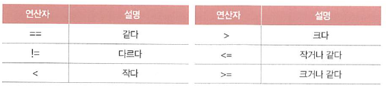

# 03-1 불 자료형과 if 조건문

- **Keywords**
    - **불(boolean)**: 파이썬의 기본 자료형으로 True, False를 나타냄
    - **비교 연산자**: 숫자 또는 문자열에 적용하며, 대소를 비교
    - **논리 연산자**: not, and, or 연산자, boolean을 만들 때 사용
    - **if 조건문**: 조건에 따라 실행하거나 실행하지 않게 만들고 싶을 때 사용하는 구문.

Boolean은 불린 또는 불리언 이라는 발음으로 불림. 

Boolean operator: 불 이라고 표현

불은 오직 True, False 값만 가질 수 있다.

## 불 만들기: 비교 연산자

- 불은 비교 연산자를 통해 만든다.



- 문자열에도 비교 연산자를 적용할 수 있다.
한글 ⇒ 가나다 순으로 앞에 있는 것이 작은 값을 갖는다.

## 불 연산하기: 논리 연산자

- 불 끼리는 논리 연산자를 사용할 수 있다.


- 단항 연산자 vs. 이항 연산자
단항: -10, +10
이항: 10+10, 10-10

### not 연산자

- 단항 연산자 ⇒ 참과 거짓을 반대로 바꿀 때 사용.
- 예제 코드

    ```python
    x = 10
    under_20 = x<20
    print ("under_20", under_20)
    print ("not under_20", not under_20)
    ```

### and 연산자와 or 연산자

- and 연산자: 양쪽 변의 값이 모두 참일 때만 True
- or 연산자: 둘 중 하나만 참이어도 True

## 논리 연산자의 활용

### and 연산자

- 두 가지 조건을 충족할 때만 동작

### or 연산자

- 둘 중 하나 이기만 하면 된다.

## if 조건문이란?

- 조건에 따라 코드를 실행하거나, 실행하지 않게 만들고 싶을 때 사용하는 구문
- **조건 분기**: 조건을 기반으로 실행의 흐름을 변경하는 것
- **들여쓰기**: indent를 꼭 지켜야 함. 일반적으로, 띄어쓰기 2번 or 4번 or Tab으로 구분한다.

## 날짜/시간 활용하기

- datetime이라는 기능을 사용해, 오전 오후 인지를 출력하는 프로그램 작성.
- 본문에 나오는 예제는 너무 쉬우므로 생략

## 컴퓨터의 조건

- 불 값에 어떤 조건식을 넣으면 좋을 지 생각.
- 본문의 홀수 짝수 구분하는 예제는 그냥 해보기. → 쉬움.