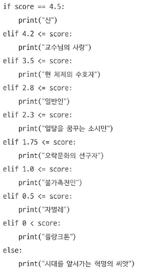

# 03-2 if~else와 elif 구문

- **Keywords**
    - **else 구문**: if 조건문 뒤에 사용, if 조건문이 거짓일 때 실행
    - **elif 구문**: if 조건문과 else 구문 사이에 입력, 3개 이상의 조건을 연결해서 사용할 때 적절.
    - **False로 변환되는 값**: None, 0, 0.0, 빈 컨테이너
    - **pass 키워드**: 프로그래밍의 전체 골격을 잡아놓고, 내부에 처리할 내용은 나중에 만들고자 할 때 사용

## else 조건문의 활용

- if 조건문의 조건이 거짓일 때 실행되는 부분

## elif 구문

- 세 개 이상의 조건을 연결해서 사용하는 방법이 필요

## if 조건문을 효율적으로 활용하기

- 학점과 같은 조건비교를 할 때 ⇒ 상위 값부터 검사해서 조건을 한번만 검색하는 방법을 채용.
- 코드에서 조건 비교를 반밖에 하지 않고, 코드의 가독성도 좀 더 향상 ⇒ 프로그램의 효율이 높아짐.

## False로 변환되는 값

- False로 변환되는 값: None, 숫자 0, 0.0, 빈 컨테이너(빈 문자열, 빈 바이트열, ...)

## pass 키워드

- 프로그래밍을 하다 보면, 일단 프로그래밍의 전체 골격을 잡아 놓고 내부에서 처리할 내용은 차근차근 생각하며 만들겠다는 의도가 있음
- 조건문, 반복문에서 내용을 채워넣지 않으면 ⇒ **IndentionError** 발생 ⇒ **pass** 키워드 사용

---

## 좀 더 알아보기

### raise NotImplementError

- pass 키워드를 입력해도 잊는 경우가 존재
- raise 키워드와 NotImplementedError를 조합해서 오류를 강제로 발생시킨다.
- `raise NotImplementedError`