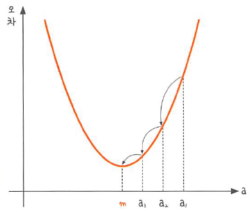

# 04 오차 수정하기: 경사 하강법

- **Keywords**
    - **경사 하강법**
    - **학습률**
    - **다중 선형 회귀**

기울기 a를 너무 크게 잡으면, 오차가 커지는 것을 확인. 

또한, 너무 작게 잡아도 오차가 커진다.



기울기 a와 오차와의 관계

**경사 하강법**: 오차를 비교하여 가장 작은 방향으로 이동시키는 방법

## 경사 하강법의 개요

$$y = x^2$$

- 위 그래프에서 `a1` 과 `a2` 그리고 `m` 을 대입하여 그자리에서 미분하면, 다음과 같은 순간 기울기가 그려진다.


- 눈여겨 봐야 할 것은 최소값 `m` 에서의 순간 기울기다. ⇒ 기울기가 0 ⇒ 미분 값이 0인 지점
    1. `a1` 에서 미분 값
    2. 구해진 기울기의 반대방향으로 이동시킨 `a2` 에서 미분을 구함
    3. 위에서 구한 미분 값이 0이 아니면 위 과정을 반복한다.


최소점 `m` 을 찾는 과정

- 경사 하강법은 이렇게 반복적으로 기울기 `a` 를 변화시켜 `m` 의 값을 찾아내는 방법

## 학습률

- learning rate: 어느 만큼 `a` 를 이동시킬지를 결정


- 딥러닝에서 학습률의 값을 적절히 바꾸면서 최적의 학습률을 찾는 것은 중요한 최적화 과정 중 하나.

## 다중 선형 회귀란?

- 추가 정보를 입력하여 새로운 예측값들을 구해 변수의 개수를 늘린 것
- 예를 들면, (공부한 시간(x1) vs. 성적(y)) + 과외 수업 횟수(x2)
- 이를 통해 두 개의 독립 변수(`x1`, `x2` 를 만들어 수식을 만들면,)


---

## 코딩으로 확인하는 경사 하강법

- 평균 제곱 오차를 수식으로 나타내면,

    

- 위 식을 `a`와 `b`로 각각 편미분 하면

    

- 여기에 학습률을 곱해 기존 `a`와 `b`를 업데이트 해준다.
- 코드

    ```python
    '''
    모두의 딥러닝 4장 경사 하강법

    작성자: 이선웅
    작성일: 2021.05.06
    '''
    import numpy as np
    import pandas as pd
    import matplotlib.pyplot as plt

    # 공부 시간 X와 성적 Y의 리스트를 만들기
    data = [[2, 81], [4, 93], [6, 91], [8, 97]]
    X = [i[0] for i in data]
    y = [i[1] for i in data]

    plt.figure(figsize = (8,5))
    plt.scatter(X,y)
    plt.show()

    X_data = np.array(X)
    y_data = np.array(y)

    a = 0
    b = 0

    lr = 0.03
    epochs = 2001

    # epoch 만큼 반복
    for i in range(epochs):
        y_pred = a*X_data + b
        error = y_data - y_pred
        # 오차 함수를 각각 편미분
        a_diff = -(2/len(X_data)) * sum(X_data*error) 
        b_diff = -(2/len(X_data)) * sum(error)
        # 학습률을 곱해 업데이트
        a = a - lr*a_diff
        b = b - lr*b_diff

        if i%100 == 0:
            print(f"epoch = {i}, 기울기 = {a}, 절편 = {b}")

    y_pred = a*X_data + b
    plt.scatter(X,y)
    plt.plot([min(X_data), max(X_data)], [min(y_pred), max(y_pred)], color='red')
    plt.show()
    ```

- 결과

    

    ```
    epoch = 0, 기울기 = 27.84, 절편 = 5.43
    epoch = 100, 기울기 = 7.073858435872394, 절편 = 50.51166161138297
    epoch = 200, 기울기 = 4.095999380762421, 절편 = 68.28224379060177
    epoch = 300, 기울기 = 2.9756829100119027, 절편 = 74.96781336233505
    epoch = 400, 기울기 = 2.5542024233262106, 절편 = 77.48302865233052
    epoch = 500, 기울기 = 2.3956349066513707, 절편 = 78.42929177728175
    epoch = 600, 기울기 = 2.3359793398132864, 절편 = 78.78529068727728
    epoch = 700, 기울기 = 2.313535987420573, 절편 = 78.91922301600925
    epoch = 800, 기울기 = 2.3050924490666174, 절편 = 78.96961044185792
    epoch = 900, 기울기 = 2.3019158585694823, 절편 = 78.98856697541248
    epoch = 1000, 기울기 = 2.3007207758016315, 절편 = 78.99569871827002
    epoch = 1100, 기울기 = 2.300271167070735, 절편 = 78.99838179089187
    epoch = 1200, 기울기 = 2.3001020172709508, 절편 = 78.9993912045567
    epoch = 1300, 기울기 = 2.300038380484562, 절편 = 78.99977096168232
    epoch = 1400, 기울기 = 2.3000144393354365, 절편 = 78.9999138322214
    epoch = 1500, 기울기 = 2.3000054323026444, 절편 = 78.99996758234106
    epoch = 1600, 기울기 = 2.300002043716771, 절편 = 78.99998780397235
    epoch = 1700, 기울기 = 2.3000007688780433, 절편 = 78.99999541166466
    epoch = 1800, 기울기 = 2.300000289263884, 절편 = 78.99999827379686
    epoch = 1900, 기울기 = 2.3000001088255795, 절편 = 78.9999993505755
    epoch = 2000, 기울기 = 2.3000000409418653, 절편 = 78.99999975567644
    ```

    

## 코딩으로 확인하는 다중 선형 회귀

- 예측 평면으로 바뀜 ⇒ 좀 더 정밀한 예측을 할 수 있다.
- 코드

    ```python
    '''
    모두의 딥러닝 4장 경사 하강법

    작성자: 이선웅
    작성일: 2021.05.06
    '''
    import numpy as np
    import pandas as pd
    import matplotlib.pyplot as plt
    from mpl_toolkits import mplot3d

    data = [[2,0,81], [4,4,93], [6,2,91], [8,3,97]]
    X1 = [i[0] for i in data]
    X2 = [i[1] for i in data]
    y = [i[2] for i in data]

    # 그래프로 확인
    ax = plt.axes(projection='3d')
    ax.set_xlabel('study_hours')
    ax.set_ylabel('private_class')
    ax.set_zlabel('score')
    ax.dist = 11
    ax.scatter(X1, X2, y)
    plt.show()

    X1_data = np.array(X1)
    X2_data = np.array(X2)
    y_data = np.array(y)

    a1 = 0
    a2 = 0
    b = 0

    lr = 0.05

    epochs = 2001

    # epoch 만큼 반복
    for i in range(epochs):
        y_pred = a1*X1_data + a2*X2_data + b
        error = y_data - y_pred
        # 오차 함수를 각각 편미분
        a1_diff = -(1/len(X1_data)) * sum(X1_data*error) 
        a2_diff = -(1/len(X2_data)) * sum(X2_data*error) 
        b_diff = -(2/len(X1_data)) * sum(error)
        # 학습률을 곱해 업데이트
        a1 = a1 - lr*a1_diff
        a2 = a2 - lr*a2_diff
        b = b - lr*b_diff

        if i%100 == 0:
            print(f"epoch = {i}, 기울기1 = {a1}, 기울기2 = {a2}, 절편 = {b}")
    ```

- 결과

    

    ```
    epoch = 0, 기울기1 = 23.200000000000003, 기울기2 = 10.5625, 절편 = 9.05
    epoch = 100, 기울기1 = 3.736651819548685, 기울기2 = 3.025225845435834, 절편 = 62.653416945915396
    epoch = 200, 기울기1 = 1.968918978431084, 기울기2 = 2.4408003370939824, 절편 = 74.66948038198655
    epoch = 300, 기울기1 = 1.598314950963438, 기울기2 = 2.3182301321830243, 절편 = 77.18880792519379
    epoch = 400, 기울기1 = 1.5206130091875423, 기울기2 = 2.2925316562084275, 절편 = 77.71701773916347
    epoch = 500, 기울기1 = 1.5043217856888822, 기울기2 = 2.287143636177872, 절편 = 77.8277638021961
    epoch = 600, 기울기1 = 1.500906118624936, 기울기2 = 2.2860139676443616, 절편 = 77.85098315585579
    epoch = 700, 기울기1 = 1.5001899795643647, 기울기2 = 2.2857771179317865, 절편 = 77.85585139558921
    epoch = 800, 기울기1 = 1.5000398316885701, 기울기2 = 2.285727459306551, 절편 = 77.85687208541762
    epoch = 900, 기울기1 = 1.5000083512319815, 기울기2 = 2.2857170477293787, 절편 = 77.85708608632612
    epoch = 1000, 기울기1 = 1.5000017509444918, 기울기2 = 2.2857148648067023, 절편 = 77.85713095440215
    epoch = 1100, 기울기1 = 1.5000003671083024, 기울기2 = 2.285714407128548, 절편 = 77.85714036157835
    epoch = 1200, 기울기1 = 1.5000000769690278, 기울기2 = 2.2857143111703637, 절편 = 77.8571423339153
    epoch = 1300, 기울기1 = 1.5000000161375586, 기울기2 = 2.285714291051484, 절편 = 77.8571427474414
    epoch = 1400, 기울기1 = 1.5000000033834466, 기울기2 = 2.285714286833298, 절편 = 77.85714283414251
    epoch = 1500, 기울기1 = 1.5000000007093846, 기울기2 = 2.285714285948902, 절편 = 77.85714285232052
    epoch = 1600, 기울기1 = 1.500000000148737, 기울기2 = 2.2857142857634787, 절편 = 77.85714285613176
    epoch = 1700, 기울기1 = 1.5000000000311857, 기울기2 = 2.2857142857245996, 절편 = 77.85714285693085
    epoch = 1800, 기울기1 = 1.5000000000065403, 기울기2 = 2.2857142857164487, 절편 = 77.85714285709838
    epoch = 1900, 기울기1 = 1.5000000000013687, 기울기2 = 2.285714285714739, 절편 = 77.85714285713354
    epoch = 2000, 기울기1 = 1.5000000000002884, 기울기2 = 2.28571428571438, 절편 = 77.8571428571409
    ```

    