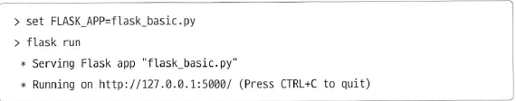

# 07-2 외부 모듈

- **Keywords**
    - **외부 모듈(external module)**: 파이썬이 기본적으로 제공하지 않는, 다른 사람들이 만들어 제공하는 모듈을 의미
    - `pip install`: 외부 모듈을 설치할 때 사용
    - **제어 역전, IoC, Inverse of Control**: 개발자가 모듈의 함수를 호출하는 것이 아니라, 개발자가 만든 함수를 모듈이 실행하는 것.
    - **라이브러리(library)**: 개발자가 모듈의 기능을 호출하는 형태
    - **프레임워크(framework)**: 모듈이 개발자가 작성한 코드를 실행

실습 환경은 네트워크에 연결된 컴퓨터와 구글 계정이다.

## 모듈 설치하기

- 외부 모듈은 `Windows` + `R` 키를 눌러 프로그램 실행 창을 띄우고 `cmd` 를 입력하면 나타나는 명령 프롬프트 창에서 실행해야한다.

    ```python
    pip install 모듈이름
    ```

- BeautifulSoup라는 모듈을 설치해보자.

    ```python
    pip install beautifulsoup4
    ```

- **pip -** 특정 버전의 모듈을 설치하거나 설치한 모듈을 제거하는 가능 등을 모두 지원한다.
pip 패키지 설치 문서 ⇒ [https://pip.pypa.io/en/stable/user_guide/#installing-packages](https://pip.pypa.io/en/stable/user_guide/#installing-packages)

## 모듈 찾아보기

- 설치했던 BeautifulSoup는 웹 페이지를 분석할 때 사용하는 모듈이다.
- 그렇다면 어떻게 필요한 모듈들을 찾아낼까?
    1. 책에서 모듈 추천
    2. 파이썬 커뮤니티에서, 어떤 모듈이 어떤 분야에서 인기
    3. 어떤 모듈이 필요해서 구글링

## BeautifulSoup 모듈

- 유명한 웹 페이지 분석 모듈이다.
- 공식 홈페이지: [https://www.crummy.com/software/BeautifulSoup/bs4/doc/](https://www.crummy.com/software/BeautifulSoup/bs4/doc/)
- 태그를 선택할때 ⇒ **select()**: 여러개 가져옴, **select_one()**: 한개만 가져옴
- **BeautifulSoup()** 라는 이름으로 미루어보아, 이는 함수가 아니라 클래스이다.
- 실습

    기상청에서 날씨 정보를 가져와 출력해보자.

    [xml_name+xml_description.pdf](07-2/midtermforecast_rss.pdf)

    - 코드

        [Google Colaboratory](https://colab.research.google.com/drive/1Di-p_9byVgrzcyAlnCYg9oD3HubrPE1W#scrollTo=G2XAFnhfRCW1&uniqifier=2)

        [https://gist.github.com/SunwungLee/f522c580fd326e1dd0e7eefc79c6442a](https://gist.github.com/SunwungLee/f522c580fd326e1dd0e7eefc79c6442a)

    - 결과

        [today_nationwide_weather.xlsx](https://drive.google.com/file/d/1-7k5tL6uQ5Y5Eojc4ppt8RsXQeEPc0Ph/view?usp=drivesdk)

## Flask 모듈

- ebooks
[점프 투 플라스크](https://wikidocs.net/book/4542) / [점프 투 장고](https://wikidocs.net/book/4223)
- 일반적으로 파이썬으로 웹 개발을 할 때, Django 또는 Flask 등의 모듈을 사용
- **Django**: 매우 다양한 기능을 제공하는 웹 개발 프레임워크
- **Flask**: 작은 기능만을 제공하는 웹 개발 프레임워크
- Flask 설치, BeautifulSoup와 마찬가지로 설치해준다.

    ```python
    pip install flask
    ```

- 공식 홈페이지: [http://flask.pocoo.org/](http://flask.pocoo.org/)
- 실습 - basic

    Hello world!

    - 코드

        ```python
        from flask import Flask
        app = Flask(__name__)

        @app.route("/") #데코레이터
        def hello():
            return "<h1>Hello World!</h1>"
        ```

    - 결과

        

    - 결과

        ![07-2/flask_%201.png)

- 이러한 형태로 모듈과 모듈을 결합하면서 원하는 프로그램을 만든다.

## 라이브러리와 프레임워크

- **라이브러리**: 정상적인 제어를 하는 모듈

    ```python
    from math import sin, cos, tan, floor, ceil

    print(sin(1))
    print(cos(1))
    print(tan(1))

    print(floor(2.5))
    print(ceil(2.5))
    ```

- **프레임워크**: 제어 역전이 발생하는 모듈

    

    Flask 내부에서 출력. 

    이처럼 개발자가 작성한 코드를 실행하는 형태의 모듈 ⇒ framework

---

## 좀 더 알아보기

### 데코레이터

- 데코레이터는 `@app.route()`형태의 코드
- 데코레이터는 크게 **함수 데코레이터**와 **클래스 데코레이터**로 나뉜다.

### 함수 데코레이터

- 함수에 사용되는 데코레이터
- 데코레이터를 사용하면 functools라는 모듈을 사용할 수 있다.
- 매개변수 등을 전달할 수 있어 반복되는 구문이 많아질 때 소스의 가독성도 높이고 매우 유용하게 사용할 수 있다.
- 실습
    - 코드

        ```python
        def test(function):
            def wrapper():
                print("인사 시작함")
                function()
                print("인사 종료됨")
            return wrapper

        @test
        def hello():
            print("hello")

        hello()
        ```

    - 결과

        ```
        인사 시작함
        hello
        인사 종료됨
        ```

---

[위키독스](https://wikidocs.net/109326)

[파이썬 코딩 도장](https://dojang.io/mod/page/view.php?id=2427)

[Python, Decorator 써본 이야기](http://abh0518.net/tok/?p=604)