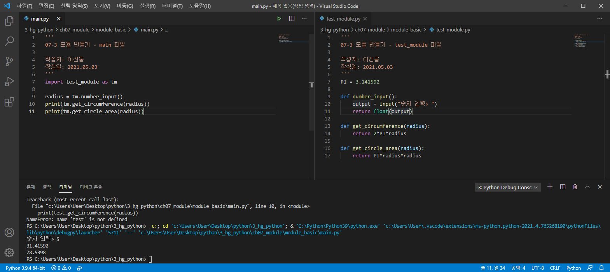

# 07-3 모듈 만들기

- **Keywords**
    - **엔트리 포인트(entry point)**: python 명령어를 사용해서 첫 진입 파일
    - **__name__=="__main__"**: 현재 파일이 엔트리 포인트인지 확인할 때 사용하는 코드
    - **패키지(package)**: 모듈들이 모인 것

파이썬 모듈을 만드는 방법은 간단 → 파이썬 파일을 만들고 → 이를 외부에서 읽어 들이면 모듈이 된다. 

## 모듈 만들기

- 같은 directory 아래 두 파일을 저장하고 `main.py` 파일을 실행한다.

    

- 복잡하고 구조화된 모듈을 만들 때 ⇒ **패키지** 기능을 사용한다**.**

## __name__=="__main__"

- 많은 파이썬 개발자들이 `__name__=="__main__"` 이라는 코드를 많이 사용
- __name__
    - 프로그래밍 언어에서 프로그램의 진입점을 엔트리 **포인트(Entry point)** 또는 **메인(Main)**이라고 부른다.
- 모듈의 __name__
    - 아래 코드를 실행하면, 엔트리 포인트 파일에서는 main, 모듈 파일에서는 모듈 이름을 출력함.

    

    ```
    결과:
    # 모듈의 __name__ 출력하기
    test_module

    # 메인의 __name__ 출력
    __main__
    ```

- __name__활용하기
    - 현재 파일이 모듈로 실행되는지, 엔트리 포인트로 실행되는지 확인할 수 있다.

        

## 패키지(package)

- import로 가져오는 것을 **모듈**
- 모듈이 모여서 구조를 이루면 ⇒ **패키지**
- 패키지 만들기
    - 간단한 예제를 보면 이해가 쉽다.
    - 이 때, test_package가 하나의 패키지가 됨.

    

- `__init__.py` 파일
    - 패키지를 읽을 때, 패키지 내부의 모듈들을 한꺼번에 가져오고 싶을 때 사용.
    - test_package 폴더 내부에 `__init__.py` 파일을 생성해서 해결.
    - 패키지를 읽어 들일 때, `__init__.py` 를 가장 먼저 실행.
    - __all__ 이라는 이름의 리스트를 만듦 → 이 리스트에 저장한 모듈들이 전부 읽어 들여짐.

    ```python
    # from test_package import *
    # 위 명령어로 모듈을 읽어들일 때
    # 가져올 모듈 리스트
    __all__ = ["module_a", "module_b"]

    print("test_package를 읽어들임")
    ```

    - 최신 버전의 파이썬은 `__init__.py` 파일이 없어도 폴더 내부 파이썬 파일들을 패키지로 자동으로 불러옴.

---

## 좀 더 알아보기

- 파일은 크게 텍스트 데이터(text data)와 바이너리 데이터(binary data)로 구분

### 텍스트 데이터

- Binary(이진 숫자): 컴퓨터가 내부적으로 모든 처리를 할 때, 0과 1만 사용.
- 인코딩: 숫자와 알파벳을 대응하는 방법
    - 가장 기본: ASCII 인코딩

        

### 바이너리 데이터

- 대표적인 예: 이미지와 동영상
이미지와 동영상은 텍스트 데이터로 표현할 수 없음.


### 인코딩과 디코딩

- 인코딩: 우리가 볼 수 있도록 변환해주는 방법.
    1. 텍스트 데이터를 맞춰서 읽기 쉬운 글자로 보여주기 위해
    2. 바이너리 데이터를 읽어서 이미지로 보여주기 위해

    예시) ASCII, UTF-8, UTF-16, EUC-KR 

- 디코딩: 인코딩된 데이터를 반대로 돌리는 것.