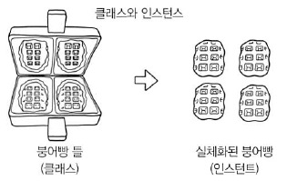

# 08-1 클래스의 기본

- **Keywords**
    - **객체(object)**: 속성을 가질 수 있는 모든 것
    - **객체 지향 프로그래밍 언어(Object Oriented Programming Language)**: 객체를 기반으로 프로그램을 만드는 프로그래밍 언어
    - **추상화(Abstraction)**: 복잡한 자료, 모듈, 시스템 등으로부터 핵심적인 개념 또는 기능을 간추려 내는 것
    - **클래스(Class)**: 객체를 쉽고 편리하게 생성하기 위해 만들어진 구문
    - **인스턴스(Instance)**: 클래스를 기반으로 생성한 객체
    - **생성자(constructor)**: 클래스 이름과 같은 인스턴스를 생성할 때 사용하는 함수
    - **메소드(method)**: 클래스가 가진 함수

C를 제외한 모든 프로그래밍 언어는 **객체 지향 프로그래밍 언어**이다.

**객체 지향 프로그램**: 객체를 우선으로 생각해서 프로그래밍한다는 의미다.

이 언어들은 클래스 기반의 객체 지향 프로그래밍 언어 ⇒ 클래스라는 것을 기반으로 객체를 만듦 ⇒ 객체를 우선으로 생각해 프로그래밍 함.

## 객체

- 프로그램을 만들 때, 데이터를 먼저 고려한다.
- **추상화**: 프로그램에서 필요한 요소만을 사용해서 객체를 표현하는 것. + 복잡한 자료, 모듈, 시스템 등으로부터 핵심적인 개념 또는 기능을 간추려 내는 것을 추상화라고 한다.
- **객체**: 여러가지 속성을 가질 수 있는 대상.
- 코드 work을 따라가면서 객체를 만들고 처리하는 법을 알아보자
    - 딕셔너리로 객체 만들기

        ```python
        students = [
                    {"name": "윤인성", "korean":87, "math":98, "english":88, "science":95},
                    {"name": "연하진", "korean":92, "math":98, "english":96, "science":98},
                    {"name": "구지연", "korean":76, "math":96, "english":94, "science":90},
                    {"name": "나선주", "korean":98, "math":92, "english":96, "science":92},
                    {"name": "윤아린", "korean":95, "math":98, "english":98, "science":98},
                    {"name": "윤명월", "korean":64, "math":88, "english":92, "science":92},
        ]
        print("이름", "총점", "평균", sep="\t")
        for student in students:
            score_sum = student["korean"] + student["math"] + student["english"] + student["science"]
            score_average = score_sum / 4

            print(student["name"], score_sum, score_average, sep="\t")
        ```

    - 객체를 만드는 함수

        ```python
        def create_student(name, korean, math, english, science):
            return{
                "name": name,
                "korean": korean,
                "math": math,
                "english": english,
                "science": science
            }

            students = [
                        create_student("윤인성", 87, 98, 88, 95),
                        create_student("연하진", 92, 98, 96, 98),
                        create_student("구지연", 76, 96, 94, 90),
                        create_student("나선주", 98, 92, 96, 92),
                        create_student("윤아린", 95, 98, 98, 98),
                        create_student("윤명월", 64, 88, 92, 92),
            ]
        print("이름", "총점", "평균", sep="\t")
        for student in students:
            score_sum = student["korean"] + student["math"] + student["english"] + student["science"]
            score_average = score_sum / 4

            print(student["name"], score_sum, score_average, sep="\t")
        ```

    - 객체를 처리하는 함수

        ```python
        def create_student(name, korean, math, english, science):
            return{
                "name": name,
                "korean": korean,
                "math": math,
                "english": english,
                "science": science
            }

        def student_get_sum(student):
            return student["korean"] + student["math"] + student["english"] + student["science"]

        def student_get_average(student):
            return student_get_sum(student) / 4

        def student_to_string(student):
            return "{}\t{}\t{}".format(student["name"], 
                                       student_get_sum(student),
                                       student_get_average(student)
                                       )
        print("이름", "총점", "평균", sep="\t")
        for student in students:
            print(student_to_string(student))
        ```

    - 결과 (모두 동일)

        ```
        이름	총점	평균
        윤인성	368	92.0
        연하진	384	96.0
        구지연	356	89.0
        나선주	378	94.5
        윤아린	389	97.25
        윤명월	336	84.0
        ```

- 객체와 관련된 코드를 분리할 수 있게 하는 것이 객체 지향 프로그래밍의 핵심이다.
- 이런 코드가 자주 사용된다 ⇒ **클래스(class)**라는 구조를 만듦.

## 클래스 선언하기

- **클래스**: 객체를 조금 더 효율적으로 생성하기 위해서 만들어진 구문

    ```python
    class 클래스이름: # 보통 클래스 이름은 캐멀케이스(CamelCase) 규칙을 지켜서 짓는다.
    	클래스 내용

    인스턴스 이름(변수이름) = 클래스이름() # 생성자 함수
    ```

- 클래스는 클래스 이름과 같은 함수(생성자)를 사용해 객체를 만든다.
- **인스턴스(instance)**: 이러한 클래스를 기반으로 만들어진 객체



## 생성자

- 클래스 이름과 같은 함수
- 클래스 내부에 `__init__` 함수를 만들면 객체를 생성할 때 처리할 내용을 작성할 수 있음.

    ```python
    def ClassName:
    	def __init__(self, 추가적 매개변수):
    		pass
    ```

- 클래스 내부의 함수는 천 번째 매개변수로 반드시 `self` 를 입력해야 한다. 이때 `self` 는 '자기 자신'을 나타내는 딕셔너리이다.
- 위에서 작성한 코드를 클래스로 구현해보자.
    - 코드

        Student 인스턴스가 생성될 때 속성이 직접 추가된다.

        ```python
        class Student:
            def __init__(self, name, korean, math, english, science):
                self.name = name
                self.korean = korean
                self.math = math
                self.english = english
                self.science = science

        students = [
                        Student("윤인성", 87, 98, 88, 95),
                        Student("연하진", 92, 98, 96, 98),
                        Student("구지연", 76, 96, 94, 90),
                        Student("나선주", 98, 92, 96, 92),
                        Student("윤아린", 95, 98, 98, 98),
                        Student("윤명월", 64, 88, 92, 92),
        ]
        print(students[0].name)
        ```

- **소멸자**: 생성자와 반대로 인스턴스가 소멸될 때 호출되는 함수
- 소멸자는 클래스 내부에 `__del__(self)` 형태로 함수를 선언해서 사용 ⇒ 프로그램이 종료될 때 소멸자가 호출됨.

## 메소드

- 클래스가 가지고 있는 함수

    ```python
    class ClassName:
    	def method(self, additional_parametres):
    		pass
    ```

- C#, Java 등의 프로그래밍 언어는 '메소드' 용어를 많이 사용. 하지만, 파이썬 프로그래밍 언어는 **멤버함수** 또는 **인스턴스 함수** 등의 용어를 더 많이 사용함.
- 코드: 클래스 내부에 함수 선언하기

    ```python
    class Student:
        def __init__(self, name, korean, math, english, science):
            self.name = name
            self.korean = korean
            self.math = math
            self.english = english
            self.science = science

        def get_sum(self):
            return self.korean + self.math + self.english + self.science

        def get_average(self):
            return self.get_sum() / 4

        def to_string(self):
            return "{}\t{}\t{}".format(self.name, 
                                    self.get_sum(),
                                    self.get_average()
                                    )

    students = [
                    Student("윤인성", 87, 98, 88, 95),
                    Student("연하진", 92, 98, 96, 98),
                    Student("구지연", 76, 96, 94, 90),
                    Student("나선주", 98, 92, 96, 92),
                    Student("윤아린", 95, 98, 98, 98),
                    Student("윤명월", 64, 88, 92, 92),
    ]

    print("이름", "총점", "평균", sep="\t")
    for student in students:
        print(student.to_string())
    ```