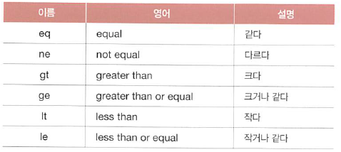

# 08-2 클래스의 추가적인 구문

- **Keywords**
    - **isinstance()**: 함수는 어떤 클래스의 인스턴스인지 확인할 때 사용하는 함수
    - **클래스 변수, 클래스 함수**: 클래스 이름 뒤에 `.` (마침표)를 찍고 바로 사용할 수 있는 클래스가 갖고 있는 변수와 함수
    - **상속**: 어떤 클래스를 기반으로 그 속성과 기능을 물려받아 새로운 클래스를 만드는 것

클래스를 기반으로 속성과 기능을 물려받아 새로운 클래스를 만드는 `상속`, 객체가 어떤 클래스를 기반으로 만들었는지 확인하는 `isinstance()` , 파이썬이 기본적으로 제공하는 `str()` 함수 or 연산자를 사용해서 클래스의 특정 함수를 호출할 수 있게 해주는 기능이 대표적.

## 어떤 클래스의 인스턴스인지 확인하기

- `isinstance()`: 객체(인스턴스)가 어떤 클래스로부터 만들어졌는지 확인하는 함수

    ```python
    # 인스턴스가 해당 클래스를 기반으로 만들어졌다면 True
    isinstance(인스턴스, 클래스)

    # 단순한 인스턴스 확인이라면
    type(인스턴스) == 클래스
    ```

- 하나의 리스트 내부에 여러 종류의 인스턴스가 들어있을 때, 인스턴스들을 구분하며 속성과 기능을 사용할 때 사용.
- 코드

    ```python
    class Student:
        def study(self):
            print("공부를 합니다.")
    class Teacher:
        def teach(self):
            print("학생을 가르칩니다.")

    classroom = [Student(), Student(), Teacher(), Student(), Student()]

    for person in classroom:
        if isinstance(person, Student):
            person.study()
        elif isinstance(person, Teacher):
            person.teach()
    ```

## 특수한 이름의 메소드

- 클래스를 기반으로 객체를 만들고 객체 뒤에 `.` (마침표)를 입력해서 자동 완성 기능을 살펴보면 많은 함수들이 존재.
- `__<이름>__()` 형태로 되어있다. ⇒ 특수한 상황에 자동으로 호출
- 예제 코드: `__str__()` 함수

    str(객체)를 호출할 때, `__str__()` 함수가 자동으로 호출된다.

    ```python
    class Student:
        def __init__(self, name, korean, math, english, science):
            self.name = name
            self.korean = korean
            self.math = math
            self.english = english
            self.science = science

        def get_sum(self):
            return self.korean + self.math + self.english + self.science

        def get_average(self):
            return self.get_sum() / 4
        def __str__(self):
            return "{}\t{}\t{}".format(self.name, 
                                    self.get_sum(),
                                    self.get_average()
                                    )

    students = [
                    Student("윤인성", 87, 98, 88, 95),
                    Student("연하진", 92, 98, 96, 98),
                    Student("구지연", 76, 96, 94, 90),
                    Student("나선주", 98, 92, 96, 92),
                    Student("윤아린", 95, 98, 98, 98),
                    Student("윤명월", 64, 88, 92, 92),
    ]

    print("이름", "총점", "평균", sep="\t")
    for student in students:
        print(str(student))
    ```

- 예제 코드: 크기 비교 함수들

    

    ```python
    class Student:
        def __init__(self, name, korean, math, english, science):
            self.name = name
            self.korean = korean
            self.math = math
            self.english = english
            self.science = science

        def get_sum(self):
            return self.korean + self.math + self.english + self.science

        def get_average(self):
            return self.get_sum() / 4
        def __str__(self):
            return "{}\t{}\t{}".format(self.name, 
                                    self.get_sum(),
                                    self.get_average()
                                    )
        def __eq__(self, value):
            return self.get_sum() == value.get_sum()
        def __ne__(self, value):
            return self.get_sum() != value.get_sum()
        def __gt__(self, value):
            return self.get_sum() > value.get_sum()
        def __ge__(self, value):
            return self.get_sum() >= value.get_sum()
        def __lt__(self, value):
            return self.get_sum() < value.get_sum()
        def __le__(self, value):
            return self.get_sum() <= value.get_sum()

    students = [
                    Student("윤인성", 87, 98, 88, 95),
                    Student("연하진", 92, 98, 96, 98),
                    Student("구지연", 76, 96, 94, 90),
                    Student("나선주", 98, 92, 96, 92),
                    Student("윤아린", 95, 98, 98, 98),
                    Student("윤명월", 64, 88, 92, 92),
    ]

    student_a = students[0]
    student_b = students[1]

    print(f"{student_a.name} == {student_b.name} = {student_a == student_b}")
    print(f"{student_a.name} != {student_b.name} = {student_a != student_b}")
    print(f"{student_a.name} > {student_b.name} = {student_a > student_b}")
    print(f"{student_a.name} >= {student_b.name} = {student_a >= student_b}")
    print(f"{student_a.name} < {student_b.name} = {student_a < student_b}")
    print(f"{student_a.name} <= {student_b.name} = {student_a <= student_b}")
    ```

## 클래스 변수와 메소드

- 인스턴스가 속성과 기능을 가질 수도 있다 + 클래스가 속성(변수)와 기능(함수)를 가질 수도 있다.

### 클래스 변수

- 클래스 변수는 class 구문 바로 아래의 단계에 변수를 선언

    ```python
    class ClassName:
    	classvar = value

    ClassName.classvar
    ```

- 예제 코드

    ```python
    class Student:
        count = 0

        def __init__(self, name, korean, math, english, science):
            self.name = name
            self.korean = korean
            self.math = math
            self.english = english
            self.science = science
            Student.count += 1
            print(f"{Student.count}번째 학생이 생성.")

    students = [
                    Student("윤인성", 87, 98, 88, 95),
                    Student("연하진", 92, 98, 96, 98),
                    Student("구지연", 76, 96, 94, 90),
                    Student("나선주", 98, 92, 96, 92),
                    Student("윤아린", 95, 98, 98, 98),
                    Student("윤명월", 64, 88, 92, 92),
    ]
    print()
    print(f"현재 생성된 총 학생수는 {Student.count}명 입니다.")
    ```

### 클래스 함수

- 클래스 함수도 클래스 변수처럼 그냥 클래스가 가진 함수이다.
- 일반적인 함수로 만드나 클래스 함수로 만드나 사용에는 큰 차이가 없다.
- `클래스가 가진 기능` 이라고 명시적으로 나타내는 것일 뿐.
- **데코레이터**: `@` 로 시작하는 것을 파이썬에서는 테코레이터라고 한다. 
함수 데코레이터, 클래스 데코레이터로 나뉨.

    ```python
    class ClassName:
    	@classmethod
    	def classfunction(cls, 매개변수): # cls : class
    		pass
    # 호출하기
    ClassName.classfunction(매개변수)
    ```

- 코드: 클래스 함수 만들기

    ```python
    class Student:
        count = 0
        students = []

        # 클래스 함수
        @classmethod
        def print(cls):
            print("----- 학생목록 -----")
            print("이름\t총점\t평균")
            for student in cls.students:
                print(str(student))
            print("----- ----- -----")
        # 인스턴스 함수
        def __init__(self, name, korean, math, english, science):
            self.name = name
            self.korean = korean
            self.math = math
            self.english = english
            self.science = science
            Student.count += 1
            Student.students.append(self)

        def get_sum(self):
            return self.korean + self.math + self.english + self.science

        def get_average(self):
            return self.get_sum() / 4

        def __str__(self):
            return "{}\t{}\t{}".format(self.name, 
                                    self.get_sum(),
                                    self.get_average()
                                    )

    Student("연하진", 92, 98, 96, 98)
    Student("윤인성", 87, 98, 88, 95)
    Student("구지연", 76, 96, 94, 90)
    Student("나선주", 98, 92, 96, 92)
    Student("윤아린", 95, 98, 98, 98)
    Student("윤명월", 64, 88, 92, 92)
    Student("김미화", 82, 86, 98, 88)
    Student("김연화", 88, 74, 78, 92)
    Student("박아현", 97, 92, 88, 95)
    Student("서준서", 45, 52, 72, 78)

    Student.print()
    ```

---

## 좀 더 알아보기

### 가비지 컬렉터(Garbage collector)

- 프로그래밍 언어의 내부에서 일어나는 일 중에서 자주 언급되는 개념
- **스왑**: 프로그램 내부에서 무언가를 생성 ⇒ 메모리 위에 올림 ⇒ 메모리가 부족하면 하드디스크를 메모리처럼 사용
- 계속해서 프로그램에서 변수를 만들면 메모리가 가득 찰 수도 있다.
- 가비지 컬렉터는 더 사용할 가능성이 없는 데이터를 메모리에서 제거 ⇒ 변수에 저장되지 않거나, 함수 등에서 나오면서 변수를 활용할 수 없게 되는 경우

### 프라이빗 변수와 게터/세터

- 객체를 효율적으로 사용하기 위한 추가 기능
1. 프라이빗 변수
    - 변수를 마음대로 사용하는 것을 막는다.
    - `__<변수이름>` 형태로 선언한다.
2. 게터와 세터
    - 코드 중간에 값을 변경하고 싶다면?
    - getter와 setter를 사용해 프라이빗 변수의 값을 추출하거나 변경하도록 간접적으로 속성에 접근
3. 데코레이터를 사용한 게터와 세터
- 전체 코드

    ```python
    import math

    class Circle:
        def __init__(self, radius):
            self.__radius = radius
        def get_circumference(self):
            return 2*math.pi*self.__radius
        def get_area(self):
            return math.pi*(self.__radius**2)
        
        def get_radius(self):
            return self.__radius
        def set_radius(self, value):
            self.__radius = value

        @property
        def radius(self):
            return self.__radius
        @radius.setter
        def radius(self, value):
            if value <= 10:
                raise TypeError("길이는 양수여야 함.")
        
    circle = Circle(10)
    print("# 원의 둘레와 넓이를 구한다.")
    print(f"원의 둘레: {circle.get_circumference()}")
    print(f"원의 넓이: {circle.get_area()}")
    print()

    print(f"# __radius에 접근합니다.")
    print(circle.get_radius())
    print()

    circle.set_radius(2)
    print("# 반지름을 변경하고 원의 둘레와 넓이를 구한다.")
    print(f"원의 둘레: {circle.get_circumference()}")
    print(f"원의 넓이: {circle.get_area()}")
    print()

    print("# 강제로 예외를 발생시키자")
    circle.radius = -10
    ```

### 상속

1. 상속
    - 클래스 기반의 객체 지향 언어들이 지원하는 기능
    - 다른 누군가가 만들어 놓은 기본 형태에 내가 원하는 것만 교체하는 것
2. 다중 상속
    - 다른 누군가가 만들어 놓은 형태들을 조립해서 내가 원하는 것을 만드는 것

    프로그래밍 언어는 기반이 되는 것을 **부모(parent)**, 이를 기반으로 생성한 것을 **자식(child)**라고 한다.

    부모가 자신의 기반을 물려주는 기능이므로 **상속**으로 부른다.

    - 코드

        ```python
        class Parent:
            def __init__(self):
                self.value = "테스트"
                print("Parent class의 init 메소드가 호출")
            def test(self):
                print("Parent class의 test 메소트 호출")

        class Child(Parent):
            def __init__(self):
                Parent.__init__(self)
                print("Child class의 init 메소트 호출")

        child = Child()
        child.test()
        print(child.value)
        ```

3. 예외 클래스 만들기
    - 상속: 기존에 있는 클래스를 기반으로 조금 수정해서 내가 원하는 클래스를 만듦
    - Exception이라는 기존의 클래스를 수정해보자.
    - **재정의 / 오버라이드**: 부모에 정의되어 있는 함수를 자식에서 다시 정의하는 것
    - 코드

        ```python
        class CustomException(Exception):
            def __init__(self, message, value):
                Exception.__init__(self)
                self.message = message
                self.value = value

            def __str__(self):
                return self.message

            def print(self):
                print("##### 오류!!! #####")
                print("메시지: ", self.message)
                print("값: ", self.value)
            
        try:
            raise CustomException("딱히 이유 없음", 273)
        except CustomException as e:
            e.print()
        ```